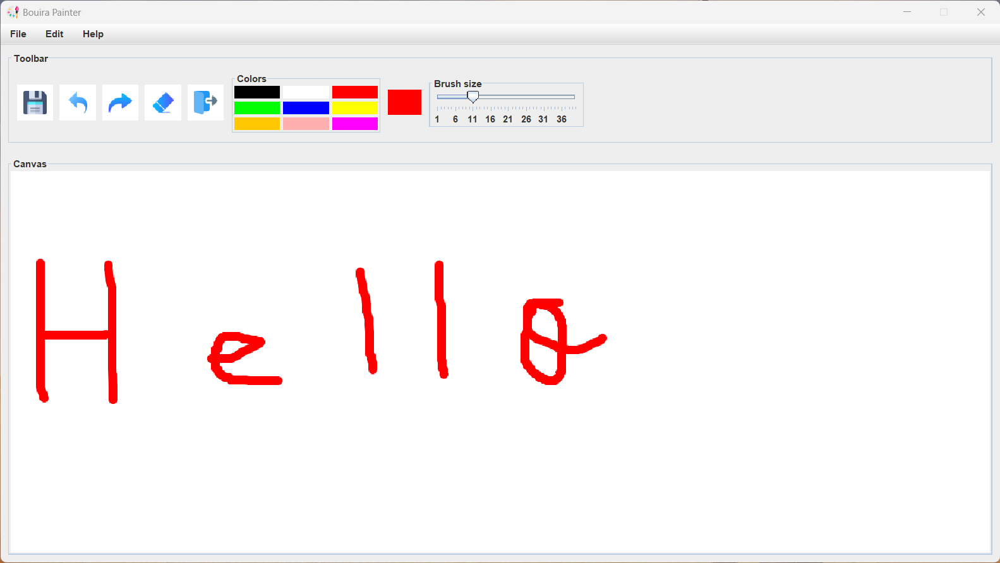

# Bouira-Painter
Bouira painter is a basic painter application that was made using JavaSwing.

## ✨ Features
### 👋 Splash screen
The app starts with splash screen (5 seconds then disapear)

### 🟦 Color picker
9 different colors to pick from

### 📏 Brush sizer
To change brush size from 1 to 40

### 💻 Other features
Undo, redo, saving drawing in hard disk (as jpg file), clear drawing area...
